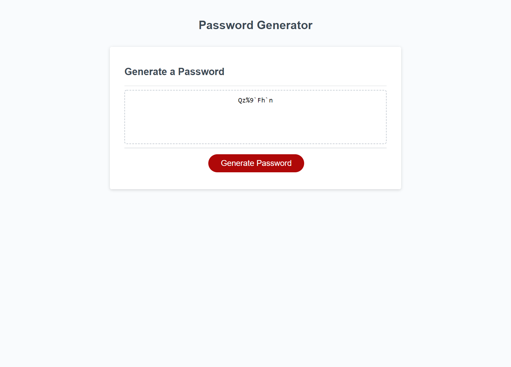

# Module-3-Challenge-Ansari

This contains the Module 3 Challenge
## Description
- This project was undertaken in order to create a random password generator
- The goal was to create a button that would prompt the user for password length and character types. It would then generate a password that met the users specifications.
- Doing so generates secure passwords for use.
- Working on this project showed the importance creating psuedo code, as well as working through the logic of the whole project before beginning to code.

## Usage

- to use this site one ought to simply click on the generate password button
- then answer the pop ups that follow
- if an invalid input is entered, the user is prompted and told to try again
- at this point simply press the generate button again 

## Screenshot
